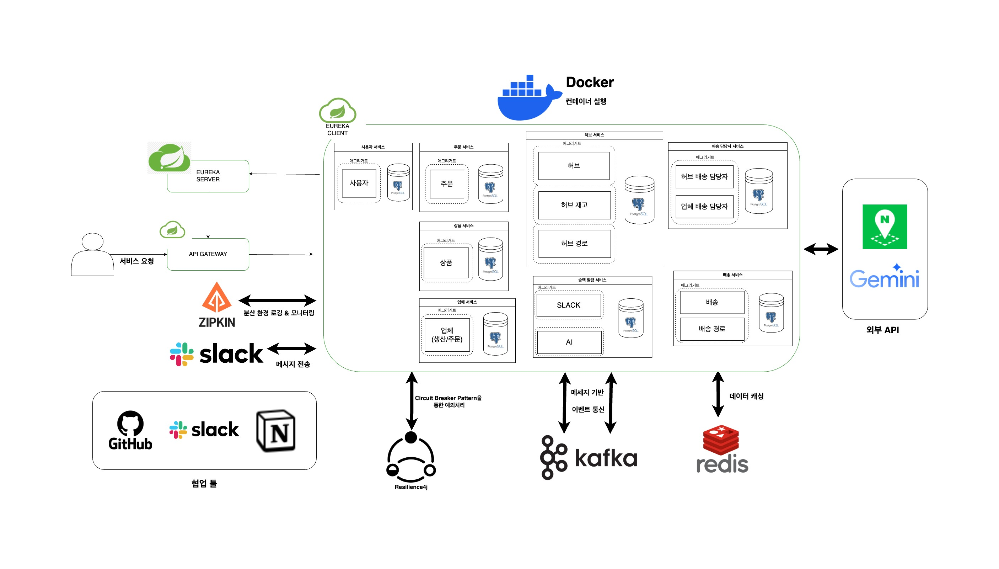
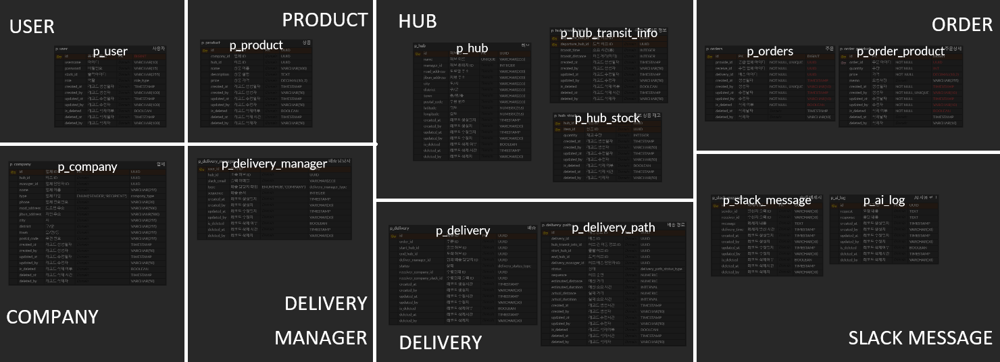
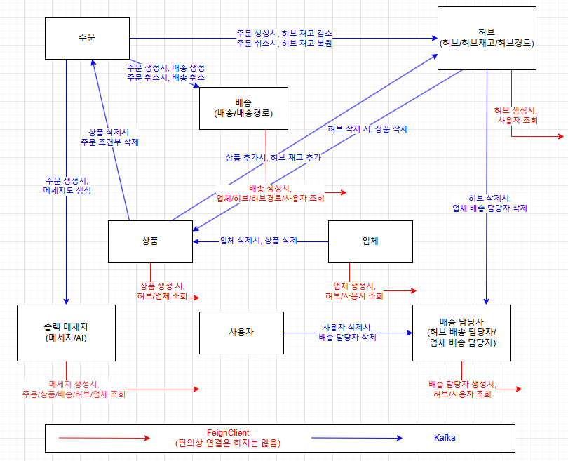

# SpartaLogistic
내배캠 백앤드 심화 3기 23조 프로젝트

## 프로젝트 개요
- 주제: B2B 물류 관리 및 배송 시스템  
- 목표: MSA 기반의 물류/배송 서비스 개발

## 팀원 소개
- 강민: 팀장 / 상품 및 도메인 서비스 / 카프카 설정
- 김형찬: 테크리더 / 허브 및 배송 담당자 서비스 / 프로젝트 구조 설정
- 이동하: 사용자 및 메세지 서비스 / 인증 및 슬랙 설정
- 박주희: 업체 및 배송 서비스 / 테스트 설정

## 프로젝트 구조

설계
- 유레카 서버 (19090)
- 게이트웨이 (19091)
- Config 서버 (18080)
- 8개 도메인
  - 사용자 (19092)
  - 허브 (19093)
  - 업체 (19094)
  - 상품 (19095)
  - 주문 (19096)
  - 배송 (19097)
  - 배송 담당자 (19098)
  - 슬랙 메세지 (19099)  

구현 중 추가
  - 인증 (18081)
  - 공통 모듈

## 사용 기술
- 개발 언어: Java 17
- 백앤드: Spring Boot 3
- 데이터베이스: PostgreSQL, Redis
- 빌드 툴: Gradle
- API 게이트웨이: Spring Cloud Gateway
- 서비스 디스커버리: Spring Cloud Eureka
- 메세징 큐: Kafka
- 서킷 브레이커: Resilience4j
- Config 설정: Spring Config
- 분산 추적: zipkin
- 실행 컨테이너: docker, docker-compose
- API 문서화: swagger
- 외부 API: gemini AI, 네이버 Map API

## ERD
[erd 상세 내용](https://www.notion.so/teamsparta/ERD-1b32dc3ef51480048d4adeea1c8d9a97?pvs=4)  

## 주요 기능
- 8개 도메인 별 CRUD 및 검색
  - 예) 회원가입, 로그인, 주문 생성, 배송 생성, 상품 수정, 주문 조회, 사용자 삭제  
  
- Kafka & FeignClient를 이용한 서로 다른 도메인 통신
  - 다른 서비스 호출 중 단순 조회 호출인 경우 FeignClient를 사용
  - 생성, 수정, 삭제 호출인 경우 Kafka 이벤트를 사용
  - 토픽을 실행 행위 단위로 구분, 컨슈머는 도메인 별로 그룹으로 구분
  

- 외부 API 및 AI활용
  - Gemini AI를 이용한 주문 메세지 자동 생성
  - 메세지 서비스에서 슬랙 호출
  - 네이버 Map API를 이용한 배송 최단 경로 추출

## API 앤드 포인트
11개 컨트롤러, 총 **75개** API  
[API Endpoints](API_ENDPOINTS.md)

## 트러블 슈팅
- [Kafka 사용 중 dto 인식 오류](https://www.notion.so/teamsparta/kafka-DTO-1bd2dc3ef51480a5a937f0c059f35f8d?pvs=4)
- [Kafka 수신 후 FeignClient 사용 오류](https://www.notion.so/teamsparta/kafka-feignclient-1c02dc3ef514806fb19bc97b4145fd8a?pvs=4)